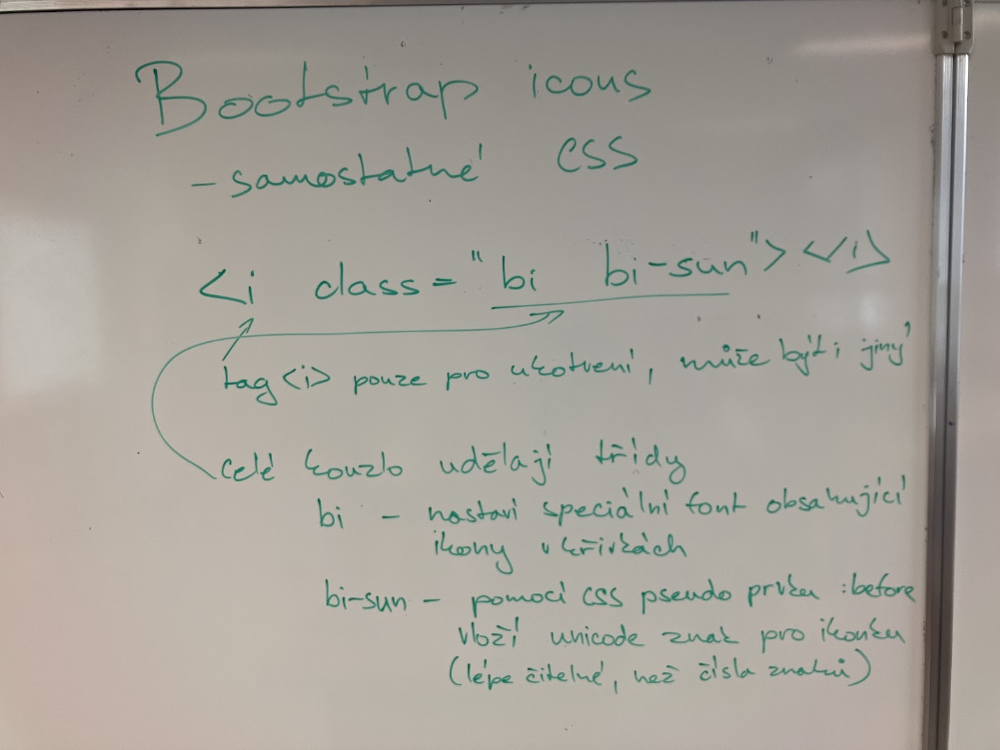

# Zapisky z hodiny 19.1.
## Bootstrap ikony

* samostatné css
* to je potřeba importovat z [bootstrap webovek](https://icons.getbootstrap.com/)
* command na import : `<link rel="stylesheet" href="https://cdn.jsdelivr.net/npm/bootstrap-icons@1.11.3/font/bootstrap-icons.min.css">`
* díky tomuto css souboru můžeme využívat jeho tříd, které dělají celé "kouzlo"
* bi - nastaví specialní font, který obsahuje ikony v křivkách
* bi-sun pomocí CSS pseudo prvku: before vloží unicode znak pro ikonku - to je lépe čitelné než čísla znaků 
